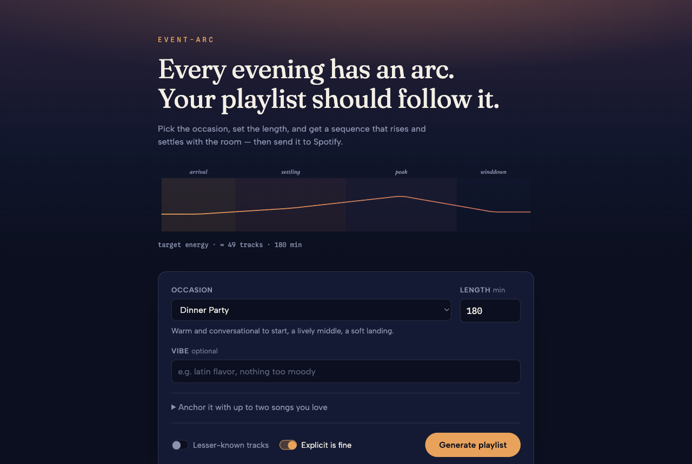
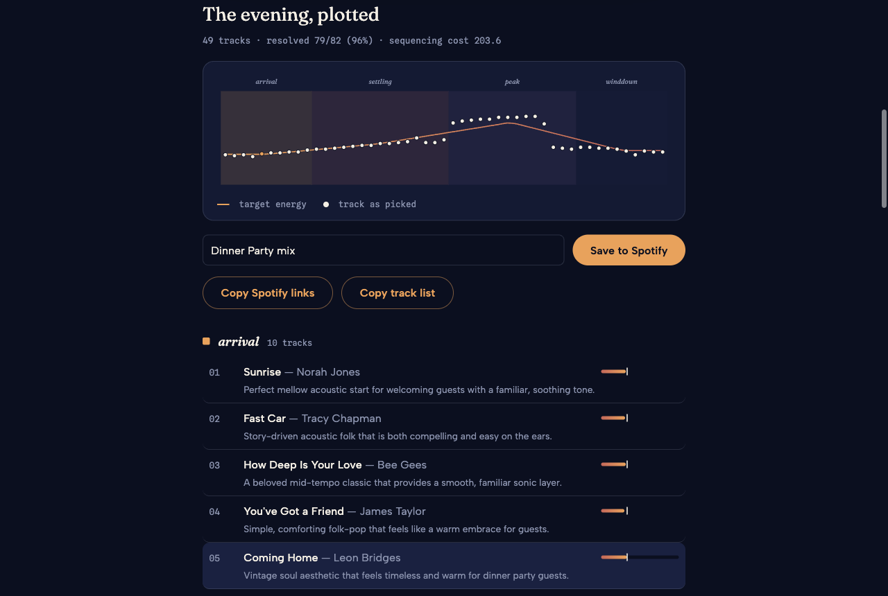

# Event-Arc

Generate Spotify playlists that follow the energy arc of an event — warm arrival, building middle, soft landing — instead of shuffling tracks at one flat intensity.

Pick an occasion (dinner party, workout, focus session…), set a length, optionally anchor it with songs you love, and get a sequenced tracklist you can save straight to Spotify.



## How it works

1. **Arc model.** Each occasion is a template of phases (e.g. *arrival → settling → peak → winddown*), each with a duration fraction and target ranges for energy, valence, and tempo. The chosen length is divided into track slots and a smooth target-energy curve is interpolated through the phase midpoints (`app/arc/curve.py`).
2. **LLM candidates.** Gemini proposes candidate tracks per phase with estimated energy/tempo/valence and a one-line rationale, steered by the brief (vibe text, seed songs, discovery mode, explicit filter) (`app/llm/`).
3. **Spotify resolution.** Candidates are resolved to real tracks via Spotify search, backed by a local cache so repeat generations barely touch the API (`app/spotify/`).
4. **Sequencing.** A cost-based sequencer assigns tracks to slots — penalizing target-energy misses, adjacent energy jumps, and same-artist clumping (`app/arc/sequencer.py`).
5. **Result.** The UI plots picked tracks against the target curve; logged-in users save the playlist to Spotify in one click.



The energy curve you see before generating is the same math the backend sequences against — it morphs live as you change the occasion or length, and costs zero API calls.

## Stack

- **Backend**: Python 3.12, FastAPI, httpx — no framework beyond that.
- **LLM**: Gemini via `google-genai`.
- **Spotify**: Web API with PKCE user auth, plus a client-credentials fallback so visitors can generate without logging in. Deliberately avoids the deprecated `audio-features` and `recommendations` endpoints.
- **Frontend**: a single hand-written HTML/CSS/JS page, no build step. The arc is plain SVG.
- **Tooling**: uv, ruff, pytest (104 tests, no network needed).

See [REFERENCES.md](REFERENCES.md) for full API and dependency notes.

## Running it

```bash
cp .env.example .env   # fill in the values below
uv run uvicorn app.main:app --reload
```

Required environment variables:

| Variable | What it is |
|---|---|
| `GEMINI_API_KEY` | Google AI Studio key |
| `GEMINI_MODEL` | e.g. `gemini-2.5-flash` |
| `SPOTIFY_CLIENT_ID` | From the Spotify developer dashboard |
| `SPOTIFY_REDIRECT_URI` | e.g. `http://127.0.0.1:8000/callback` |
| `SPOTIFY_CLIENT_SECRET` | Optional — enables visitor (no-login) generation |

Tests and lint:

```bash
uv run pytest -q
uvx ruff check .
```

## Constraints worth knowing

- The Spotify app runs in **development mode**: max 5 invited users, and a modest daily search quota (~230 calls/day observed). A per-day call-budget guard in `app/main.py` stops generation before the quota does.
- The resolution cache (`scripts/seed_cache.py` pre-warms it) cuts a first-time generation from ~25 Spotify calls to ~8 on repeats.
- Visitors without a Spotify login can generate and copy track links, but saving a playlist requires an invited account.

## Project layout

```
app/
  arc/        phase templates, target curve, sequencer (pure logic, fully tested)
  llm/        Gemini prompt + candidate generation
  spotify/    PKCE auth, search/resolve, playlist create, call cache
  static/     the single-page UI
  main.py     FastAPI routes + call-budget guard
scripts/      cache pre-warming
tests/        104 pytest tests, all offline
```
